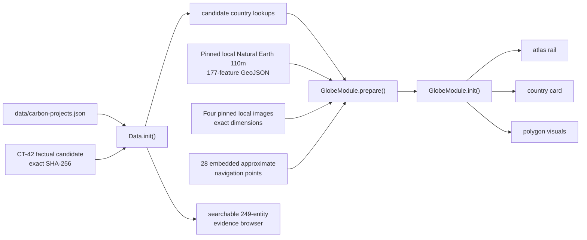
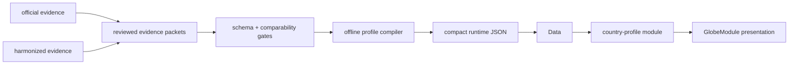

# Earth Love United — v1 Architecture Map

> Read this before changing runtime code. `AGENTS.md` contains the rules;
> this file records the live module graph, data flow, stacking model, and
> extension points.

**Runtime baseline:** 2026-07-17
**Architecture:** one production foundation page plus a separately governed
Climate Public Beta engineering page; classic scripts, no bundler or browser
build

## Public surface

`index.html` owns the public journey:

```text
site navigation
  → hero and live carbon clock
  → foundation story and projects
  → living-globe explanation
  → carbon services
  → partners, open-source commitment, team, tribute, contact

hero / Living Globe action
  → App.enterGlobe()
  → lazy-load globe.gl
  → initialize GlobeModule
  → country atlas rail + selected-country card
  → App.exitGlobe() returns to the foundation page
```

The former GAIA, quiz, biome, scenario, pledge-wall, declarative-learning,
NDVI, and event-globe systems are parked in `_archive/v1-cut/`. They are not
runtime dependencies and must not be resurrected without an architecture
mission.

### Separate Climate Public Beta surface

`climate-public-beta/` is a second, independently governed, fail-closed static
engineering surface for a planned factual emissions beta. No reviewed beta
runtime or publication authority exists yet. It is not part of `index.html`, the
assessed globe runtime, the production service worker, or the production
IIFE/module-contract graph. Its small page bootstrap uses a page-local IIFE and
exports `window.CLIMATE_PUBLIC_BETA` for bootstrap and testing, but it is not
loaded by `index.html`, does not participate in the production
`safeCall`/`MODULE_CONTRACTS` graph, and registers no module contract.

The beta foundation is being isolated on a mission branch for a protected,
foundation-only PR. Until that PR is reviewed and merged, it is not on `main`,
is not authoritative CI, and is not a release package. The full mixed local
engineering candidate passed its deterministic fixtures, including policy (5
passing states / 55 fail-closed mutations), access bootstrap (6 / 95), remote
evidence (10 / 58), readiness (48 cases), governance contracts (4 / 74),
artifact generation (4 / 8), package validation (7 / 74 plus 18
schema-semantics cases), and diff classification (7 expected-pass / 14
adversarial). The in-app local 320px fail-closed browser check passed with no
overflow, external automatic assets, or console errors. Those results must be
reproduced from the exact clean F commit where applicable; protected browser
CI and full GitHub CI remain pending. Fixture and local-browser results grant
no review or publication authority.

The protected foundation PR is deliberately non-deploying. It may contain
schemas, compilers, libraries, review/checker foundations, the fail-closed UI
shell, tests, and planning documentation, but it must exclude every
deployment-control path. At minimum, `.github/workflows/**`,
`climate-public-beta/_headers`, `tools/build-climate-public-beta.sh`,
`tools/check-climate-public-beta-diff-boundary.js`,
`tools/check-climate-public-beta-readiness.js`,
`tools/lib/climate-public-beta-diff-boundary.js`,
`tools/stage-climate-public-beta.js`,
`tools/check-staged-climate-public-beta-integrity.js`, and
`tools/org-setup.sh` are forbidden from F. The pure
`tools/lib/climate-public-beta-path-policy.js` is the foundation-safe source
that classifies those later controls without importing them. The read-only
surface-policy checker and library remain foundation-safe; they validate an
explicit directory but do not stage, build, upload, expose, or authorize it.
The event-relative CI semantics and all deployment controls enter only on the
active BR/BP/BA package branch, are statically and dynamically discovered by
package review, and are pinned by the BA scope before the commit-preserving
package PR can merge.

The beta surface remains nonpublishable until its own policy engine verifies
the exact reviewed data, rights decision, five required independent
attestations (data, rights, UI/accessibility, package, and rollback),
rollback rehearsal, protected scope, provisioned public-key registry, and
detached release approval. A distinct private access-bootstrap proof must show
that the dedicated hosting project already serves beta-free holding bytes
behind project-wide access control before the first approved beta byte may be
staged. Private observations and signatures stay outside the repository.

```text
protected non-deploying foundation-only merge (F)
  → freeze exact release ID, policy, governance contracts, public keys,
    hosting/access contract, and rights path
  → private source proposal + genuine rights/data review/signatures
  → immutable seven-file beta runtime + runtime manifest
  → committed pre-results UI review subject (BR)
  → executed UI/accessibility/comprehension protocol + signed review
  → expected public-surface manifest + reviewed diff/package, including
    package-branch deployment controls and later event-relative CI
  → BP (pre-proof content commit)
  → executable rollback proof + independent rollback review
  → BA (scope pins deployment, CI, and merge-governance controls)
  → commit-preserving package-PR merge
  → offline L1 approval + approval-only BB-L1
  → private L1 access bootstrap + trusted upload transaction + remote preflight
  → invited sharing and signed invited evidence
  → offline L2 approval + approval-only BB-L2
  → chained L2 bootstrap + repeated trusted transaction +
    preflight/controlled activation/monitoring
```

The dedicated Cloudflare Pages beta project uses trusted-operator Direct
Upload of the locally/private-gated `_deploy_beta` bytes, not automatic Git
deployment. Its reviewed host model binds the stable
`https://<project-id>.pages.dev` origin, the
`.<project-id>.pages.dev` deployment-alias suffix, any stable custom aliases,
and Access applications/policies covering the `pages.dev` apex, wildcard
deployment/preview hosts, and every custom domain. Approvals bind stable
aliases; each access and remote run must additionally probe the exact atomic
`https://<deployment-id>.<project-id>.pages.dev` origin observed for that
holding or uploaded deployment.

Each signed remote transition is chronological and fail-closed. Within one
transition, observations are ordered deployment → access → surface → browser →
production baseline → rollback/withdrawal → feedback. The next transition's
first observation, attestation, and `signed_at` must all be later than the
prior transition's `signed_at`; L2 approval cannot predate the signed invited
evidence. When a transition is being used for a current publication action,
its attestation and every freshness-critical access/surface/browser/baseline/
rollback/feedback observation (plus the applicable monitoring boundary) must
fall within the single policy-frozen remote-probe interval at verification.

`tools/check-climate-public-beta-readiness.js` has deliberately separate
non-authorizing package/approval-validation modes for protected PR review and
an `access-controlled-preflight` mode for staging. Only the latter can permit
staging, and it still cannot authorize invited sharing or public activation.
`tools/build-climate-public-beta.sh` and the stager both rerun that gate; the
final staged checker reruns it again before completing.

**HIGH — trusted upload transaction is not implemented.** The current
check/build/stage commands can validate bytes and access, but a later manual
upload is a separate operation with a check-to-use and inventory-binding gap.
No existing procedure may claim that those earlier checks prove the bytes
actually sent. Before any L1 or L2 upload, one reviewed transaction must
perform a fresh access gate, freeze and digest the immutable staged inventory,
Direct Upload that exact tree to the exact project, capture the provider
deployment ID, atomic origin, and receipt, immediately probe unauthorized
denial, the exact allowed surface, forbidden candidate/governance paths, and
`/sw.js`, and produce signed operator evidence binding the entire transaction.
Until that mechanism
and its receipt verification exist and are independently reviewed, deployment
remains blocked.

**HIGH — current GitHub merge governance destroys the required commits.**
`tools/org-setup.sh` configures squash-only merges and required linear history,
while `.github/workflows/auto-merge.yml` always requests `--squash`. Either
path rewrites BR/BP/BA and makes their exact ancestry/signature bindings
unverifiable. Both files and the canonical repository-settings contract are
deployment controls: they stay out of F, enter the active package branch,
receive static/dynamic package review, and are pinned in BA. Before the package
PR can merge, a maintainer must apply reviewed settings that allow a
commit-preserving merge and disable required linear history, the package PR
must prohibit squash/rebase/auto-squash, and the merge result must retain the
exact BR, BP, and BA object IDs.

**HIGH — PR CI currently conflates the exact head with GitHub's synthetic
merge ref.** Setting a diff command's head variable does not change the tree
checked out by `actions/checkout`. The active-package CI must run exact
package/readiness validation in an isolated checkout whose HEAD equals
`github.event.pull_request.head.sha`, then run a distinct merge-result
compatibility job against the synthetic merge result. Only the exact-head job
may validate BA bindings; the merge-result job proves compatibility and grants
no package or publication authority. This split is not implemented and remains
outside F until package-reviewed and BA-pinned.

## Runtime file map

| Layer | File | Responsibility |
|---|---|---|
| Page | `index.html` | Critical tokens/layout, public copy, DOM, script order, theme bootstrap |
| Globe presentation | `css/globe-system.css` | Globe HUD, atlas rail/card, status visuals, themes, responsive behavior |
| Clock presentation | `css/carbon-clock.css` | Carbon-clock typography and layout |
| Safety utilities | `js/gaia-utils.js` | Safe DOM access, cross-module calls, safe fluent chains, error reporting |
| Contract registry | `js/module-contracts.js` | Module interfaces, dependencies, events, runtime pre-flight validation |
| Event bus | `js/event-bus.js` | Decoupled runtime events |
| Persistence | `js/storage-adapter.js` | IndexedDB adapter and migrations |
| Persistence facade | `js/storage.js` | Safe storage API over `STORAGE_ADAPTER` |
| Data validation | `js/data-schema.js` | Runtime JSON validation |
| Data loader | `js/data.js` | Country, small-nation, and carbon-project data loading/lookups |
| Globe runtime | `js/globe.js` | globe.gl lifecycle, country geometry, atlas rail/card, selection and themes |
| Carbon clock | `js/carbon-clock.js` | Hero/topbar emissions counter |
| Application | `js/app.js` | Bootstrap, contract pre-flight, hero/globe transitions, lazy globe load |
| Offline cache | `sw.js` | Static precache and network-first data/code updates |

## Script load order

The ten classic scripts load synchronously at the end of `index.html`:

```text
1.  js/gaia-utils.js
2.  js/module-contracts.js
3.  js/event-bus.js
4.  js/storage-adapter.js
5.  js/storage.js
6.  js/data-schema.js
7.  js/data.js
8.  js/globe.js
9.  js/carbon-clock.js
10. js/app.js
```

`js/vendor/globe.gl.js` is loaded by `App.enterGlobe()` rather than at page
boot. This keeps WebGL work out of the foundation-page path.

After changing scripts or contracts, run:

```bash
python3 scripts/verify_load_order.py
```

The verifier parses script tags, `window.X` assignments, and
`MODULE_CONTRACTS.register()` declarations. It is the static module graph
authority; there is no separate `MODULE_MANIFEST`.

## Module registry

Any API reached through `safeCall()`, `safeGet()`, or `hasModule()` must exist
on `window`.

| Global | File | Contract | Main responsibility |
|---|---|---:|---|
| `MODULE_CONTRACTS` | `js/module-contracts.js` | registry itself | Runtime interface/dependency validation |
| `EventBus` | `js/event-bus.js` | infrastructure | Publish/subscribe |
| `STORAGE_ADAPTER` | `js/storage-adapter.js` | yes | IndexedDB persistence |
| `Storage` | `js/storage.js` | yes | Safe persistence facade |
| `DATA_SCHEMA` | `js/data-schema.js` | yes | Runtime data validation |
| `Data` | `js/data.js` | yes | Data load and country lookups |
| `GlobeModule` | `js/globe.js` | yes | Live globe and country atlas |
| `Panel` | `js/globe.js` | legacy internal export | Archived-site fallback helpers; not part of current public flow |
| `PanelSlider` | `js/globe.js` | legacy internal export | Archived-site fallback helpers |
| `CARBON_CLOCK` | `js/carbon-clock.js` | yes | Live counter |
| `App` | `js/app.js` | yes | Bootstrap and navigation |

`App.init()` calls `MODULE_CONTRACTS.validate()` after `Data.init()`. A
registered module must exist on `window`, expose every declared method, and
have its required globals available. Contract errors use `reportError()`.

## Standard module shape

New orchestration/evaluation modules use a classic-script global API:

```javascript
const COUNTRY_PROFILE = (() => {
  function init() {}
  function reset() { return true; }
  function destroy() { return true; }
  function getState() { return {}; }

  return { init, reset, destroy, getState };
})();

window.COUNTRY_PROFILE = COUNTRY_PROFILE;

MODULE_CONTRACTS.register('COUNTRY_PROFILE', {
  provides: ['init', 'reset', 'destroy', 'getState'],
  requires: ['Data'],
  emits: [],
  listens: [],
});
```

Add its script tag after dependencies, run the static verifier, run
`node --check`, and extend `SmokeTest` coverage. Do not place additional
evaluation policy directly into `js/globe.js`; the globe consumes a reviewed
view model.

## Data flow

### Current v1 flow



`Data.init()` applies an eight-second deadline to carbon-project and critical
candidate reads. The CT-42 candidate is parsed only after WebCrypto verifies
its exact SHA-256 and its 249 / 206 factual / 43 gap boundary. Carbon-project
data are noncritical; candidate failure blocks 3D rendering and exposes no
inferred climate values.

Before loading globe.gl, `GlobeModule.prepare()` must preload and validate the
local 177-feature GeoJSON plus all four local globe visuals. The dark surface is
a byte-for-byte 3600×1800 NASA Earth Observatory Black Marble 2012 JPEG; the
4096×2048 sky restores the original Three-Globe 2.45.2 PNG as an exact,
locally pinned decorative asset and is not astronomical evidence.
Preparation validates exact image dimensions and strong Polygon/MultiPolygon
structure. The 28 approximate
small-state points are embedded navigation affordances pinned to a hashed
manual source; disputed subfeatures and non-registry entities are excluded.
The interactive candidate deck must resolve exactly 201 registry entities
(194 factual and 7 gaps). The first-class evidence browser remains the route
to all 249 entities. CT-45 proves byte integrity and these fail-closed runtime
boundaries; it does not grant texture rights, third-party-notice completeness,
production approval, or release authority.

The deploy surface also exposes `/THIRD_PARTY_NOTICES.txt` from the origin
root and retains its machine inventory under `data/governance/vendor/`. The
notice checker pins the source and final staged bytes, integration record, and
future approval schema. A protected, exact-hash trust registry is currently
empty and `unprovisioned`; approval and detached signature artifacts are absent.
Notice integrity does not confer rights approval: the inventory core flags are
historical inventory-only properties, and production requires five
asset-specific rights dispositions plus four counsel resolutions in an exact
commit approval, followed by distinct verified Ed25519 signatures from the
asset-rights reviewer, licensing counsel, and release authorizer.

### Target country-truth flow

The approved direction is documented in:

- `docs/COUNTRY-CLIMATE-TRUTH-PLAN.md`
- `docs/COUNTRY-CLIMATE-METHODOLOGY.md`
- `docs/decisions/CLI-100-country-climate-profile.md`



The browser remains static. Fetching, normalization, review, and compilation
are publication tasks, not a frontend build.

## Current country-selection flow

```text
App.enterGlobe()
  → show loading state and enter globe mode
  → GlobeModule.prepare()
      ├─ candidate unavailable → #globe-fallback (candidate_data_unavailable)
      ├─ geometry invalid/unavailable → #globe-fallback (country_geometry_unavailable)
      └─ image invalid/unavailable → #globe-fallback (visual_assets_unavailable)
  → lazy-load verified local js/vendor/globe.gl.js
      └─ load failure → show body-level #globe-fallback evidence view
  → GlobeModule.init()
      ├─ missing WebGL / constructor failure → show #globe-fallback; return false
      → create globe.gl instance through safeChain()
      → activate prepared geometry and exact 201-entity deck
      → emit globe:render-ready / globe:country-data-ready
  → selectDefaultCountry()

Browse all 249 evidence records
  → requires initialized renderer + exactly one live canvas
  → show #globe-fallback in evidence_browse_requested mode
  → search/select factual series or explicit source gaps
  → Close/Escape validates the renderer again before returning

pointer or keyboard selection
  → select country feature
  → renderCountryTooltip()
  → renderCountryMetrics()
  → emit globe:country-selected

Escape / close / App.exitGlobe()
  → clear selection
  → emit globe:country-closed / app:globe-exited
```

## Event channels

| Event | Emitter | Listener/consumer |
|---|---|---|
| `app:ready` | `App` | External/optional listeners |
| `app:globe-entered` | `App` | External/optional listeners |
| `app:globe-exited` | `App` | External/optional listeners |
| `globe:render-ready` | `GlobeModule` | `App` loading state |
| `globe:country-data-ready` | `GlobeModule` | `App` loading state |
| `globe:data-error` | `GlobeModule` | `App` user-visible loading/error state |
| `globe:fallback-shown` | `GlobeModule` | `App` loading and `aria-busy` state |
| `globe:country-selected` | `GlobeModule` | External/optional listeners |
| `globe:country-closed` | `GlobeModule` | External/optional listeners |

Event names use an emitter prefix (`module:verb`). Contracts declare emitted
and listened-to channels so pre-flight can flag orphan listeners.

## Z-index stack

Top to bottom:

```text
9999  .skip-nav while focused
1000  #hex-country-tooltip, .country-atlas-card
 300  #site-nav
 200  #hero, #globe-back-btn
 110  .globe-status
 100  #topbar
  60  #globe-fallback (failure or user-invoked evidence browser), .hex-legend
  50  .country-atlas-rail
  20  .country-atlas-scrim
  10  .sections, .footer
   1  #globeViz
```

Rules:

1. Interactive overlays belong under `document.body`, not inside `#globeViz`.
2. Invisible/off-screen UI must disable pointer events.
3. A transformed element creates a stacking context.
4. `#globeViz` becomes interactive only in `body.globe-mode`.
5. Any z-index change requires `StackLint.audit()` and an update to this table.
6. `#globe-fallback` is a direct child of `body`; while active it disables the
   globe canvas, country rail/card, legend, loader, and duplicate global back
   control. Its own retry/Foundation controls and factual/gap list stay usable.

## Service worker and freshness

`sw.js` cache epoch v34 precaches the concise public truth-copy page, core CSS/JS, verified local
globe.gl, the CT-45 manifest and five localized assets, and exact-version
candidate/carbon data requests. It applies:

- network-first for `/data/`;
- network-first with browser-cache bypass for HTML, JS, and CSS;
- cache-first for other same-origin static assets. Geometry and visual-asset requests
  use digest-versioned query keys coupled to the precache entries.

Any runtime data filename or script addition requires a service-worker asset
and cache-version review. A reviewed data release must not pair new HTML with
an old profile artifact.

## Validation layers

| Layer | Tool | What it proves |
|---|---|---|
| Syntax | `node --check` | JavaScript parses |
| Static module graph | `python3 scripts/verify_load_order.py` | Contract dependencies load in order |
| Runtime contracts | `MODULE_CONTRACTS.validate()` | Registered globals and methods exist |
| Runtime behavior | `SmokeTest.run()` | Modules, data, DOM, globe, and selected interactions work |
| Stacking | `StackLint.audit()` | No known invisible blockers/z-index regressions |
| Country truth | `tools/verify-globe-country-truth.js` | Intended country-status invariants; currently requires repair for v1 |
| Public copy | `node tools/check-public-copy.js` | No unresolved draft markers; not scientific fact-checking |
| Third-party notices | `node tools/check-globe-third-party-notices.js` | Exact notice/inventory/integration bytes and active deploy/CI controls; no rights approval |
| Approval authority | `node tools/check-globe-runtime-approval.js` | Empty trust is fail closed; future detached three-role Ed25519 signatures and bindings verify |
| Final staged aggregate | `node tools/check-staged-production-integrity.js --staged _deploy` | Last-write rehash of CT-45, notices, trust, footer, and any signed approval pair |
| Beta package validation | Active-package-only: `node tools/check-climate-public-beta-readiness.js --level invited_beta --purpose package-validation` | Exact reviewed beta package is valid but cannot be staged, shared, or published; the deployment-gating checker is excluded from F |
| Beta governance contracts | `node tools/check-climate-public-beta-governance-contracts.js --self-test` | Frozen review/privacy contracts and completed UI/accessibility/comprehension results fail closed; fixtures are not human outcomes |
| Beta artifact generator | `node tools/generate-climate-public-beta-artifacts.js --self-test` | Deterministic manifest/diff/rollback/scope construction only; never signs, reviews, deploys, or authorizes |
| Beta access bootstrap | `node tools/check-climate-public-beta-access-bootstrap.js --self-test` | Private pre-upload holding/access proof contract fails closed; fixtures grant no authority |
| Beta staged aggregate | `ELU_VERIFIED_PUBLICATION_LEVEL=<level> ELU_CLIMATE_PUBLIC_BETA_ACCESS_BOOTSTRAP=<absolute-private-root> [ELU_CLIMATE_PUBLIC_BETA_PRIVATE_EVIDENCE=<absolute-private-index>] node tools/check-staged-climate-public-beta-integrity.js --staged _deploy_beta` | BA-bound candidate control: exact allowlist and hashes after the real access-controlled preflight gate; it is excluded from F and does not bind a later upload |
| Beta trusted upload transaction | Not implemented | Must atomically bind a fresh access gate and immutable staged digest to the exact project Direct Upload, provider receipt/origin, exact allowed surface, immediate denial plus forbidden/candidate/governance/`sw.js` probes, and signed operator evidence |
| Beta commit-preserving governance | Currently contradictory | `tools/org-setup.sh`, `.github/workflows/auto-merge.yml`, and live settings must disable required linear history, prohibit squash/rebase/auto-squash for the package PR, allow a merge commit, and preserve exact BR/BP/BA object IDs |
| Beta exact-head CI | Not implemented | Isolated exact PR-head validation and separate synthetic-merge compatibility must both pass; merge-ref results never authenticate BA |

The existing assessed-production CI runs syntax, static load order, SmokeTest,
and StackLint. The protected F PR must not change `.github/workflows/**`.
A separate protected beta job, its event-relative semantics, and the
deployment-gating readiness checker may enter only on the active BR/BP/BA
package branch and be pinned in BA. They are not part of F, merged, or
authoritative.
The assessed CT-42 review-ancestry issue remains an L3 assessed-production
requirement; it is not an L1/L2 factual-beta content gate and the beta must not
count as its evidence. The unchanged workflow nevertheless runs the affected
assessed commands unconditionally, so the issue also blocks protected F merge
until legitimately resolved. Assessed CI does not yet prove country-source truth, target
comparability, or scientific lineage; those gates are part of the
country-truth plan.

## Known traps and debt

| Trap/debt | Consequence | Direction |
|---|---|---|
| `const X` without `window.X` | `safeCall()` cannot see the module | Export every cross-module API |
| Ad hoc status logic in `js/globe.js` | Missing and non-comparable targets collapse together | Move policy to reviewed profile module |
| Flat `pledge-nodes.json` | No field-level lineage or scope | Replace through evidence/compiler missions |
| Remote unpinned country geometry | Availability/version drift | Pin or vendor in a later evidence mission |
| Color/opacity as status | Missing evidence can appear visually calm | Persistent impact cue plus text/icon/reason states |
| Modeled CAGR chart described as measured | Public claim exceeds evidence | Plot reviewed annual observations only |
| Carbon projects beside performance | Can soften national accountability | Separate and label as outside profile |
| Archived subsystems copied into v1 | Reintroduces dead dependencies | Architecture review before restoration |

## Before shipping

```bash
python3 scripts/verify_load_order.py
node --check js/changed-file.js
node tools/check-public-copy.js
node tools/check-globe-third-party-notices.js
```

Then serve the site and run:

```text
SmokeTest.run()
StackLint.audit()
```

For country-profile releases, also require the methodology, provenance,
comparability, golden-country, coverage, visual-truth, change-control, and
independent-review gates in `docs/COUNTRY-CLIMATE-TRUTH-PLAN.md`.
