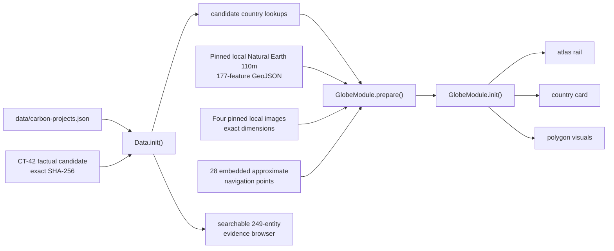
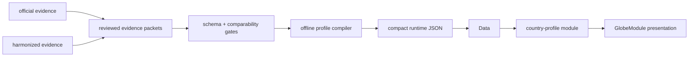

# Earth Love United — v1 Architecture Map

> Read this before changing runtime code. `AGENTS.md` contains the rules;
> this file records the live module graph, data flow, stacking model, and
> extension points.

**Runtime baseline:** 2026-07-15
**Architecture:** one HTML page, classic scripts, no bundler or browser build

## Public surface

`index.html` owns the public journey:

```text
site navigation
  → hero and live carbon clock
  → foundation story and projects
  → living-globe explanation
  → carbon services
  → partners, open-source commitment, team, tribute, contact

hero / Living Globe action
  → App.enterGlobe()
  → lazy-load globe.gl
  → initialize GlobeModule
  → country atlas rail + selected-country card
  → App.exitGlobe() returns to the foundation page
```

The former GAIA, quiz, biome, scenario, pledge-wall, declarative-learning,
NDVI, and event-globe systems are parked in `_archive/v1-cut/`. They are not
runtime dependencies and must not be resurrected without an architecture
mission.

## Runtime file map

| Layer | File | Responsibility |
|---|---|---|
| Page | `index.html` | Critical tokens/layout, public copy, DOM, script order, theme bootstrap |
| Globe presentation | `css/globe-system.css` | Globe HUD, atlas rail/card, status visuals, themes, responsive behavior |
| Clock presentation | `css/carbon-clock.css` | Carbon-clock typography and layout |
| Safety utilities | `js/gaia-utils.js` | Safe DOM access, cross-module calls, safe fluent chains, error reporting |
| Contract registry | `js/module-contracts.js` | Module interfaces, dependencies, events, runtime pre-flight validation |
| Event bus | `js/event-bus.js` | Decoupled runtime events |
| Persistence | `js/storage-adapter.js` | IndexedDB adapter and migrations |
| Persistence facade | `js/storage.js` | Safe storage API over `STORAGE_ADAPTER` |
| Data validation | `js/data-schema.js` | Runtime JSON validation |
| Data loader | `js/data.js` | Country, small-nation, and carbon-project data loading/lookups |
| Globe runtime | `js/globe.js` | globe.gl lifecycle, country geometry, atlas rail/card, selection and themes |
| Carbon clock | `js/carbon-clock.js` | Hero/topbar emissions counter |
| Application | `js/app.js` | Bootstrap, contract pre-flight, hero/globe transitions, lazy globe load |
| Offline cache | `sw.js` | Static precache and network-first data/code updates |

## Script load order

The ten classic scripts load synchronously at the end of `index.html`:

```text
1.  js/gaia-utils.js
2.  js/module-contracts.js
3.  js/event-bus.js
4.  js/storage-adapter.js
5.  js/storage.js
6.  js/data-schema.js
7.  js/data.js
8.  js/globe.js
9.  js/carbon-clock.js
10. js/app.js
```

`js/vendor/globe.gl.js` is loaded by `App.enterGlobe()` rather than at page
boot. This keeps WebGL work out of the foundation-page path.

After changing scripts or contracts, run:

```bash
python3 scripts/verify_load_order.py
```

The verifier parses script tags, `window.X` assignments, and
`MODULE_CONTRACTS.register()` declarations. It is the static module graph
authority; there is no separate `MODULE_MANIFEST`.

## Module registry

Any API reached through `safeCall()`, `safeGet()`, or `hasModule()` must exist
on `window`.

| Global | File | Contract | Main responsibility |
|---|---|---:|---|
| `MODULE_CONTRACTS` | `js/module-contracts.js` | registry itself | Runtime interface/dependency validation |
| `EventBus` | `js/event-bus.js` | infrastructure | Publish/subscribe |
| `STORAGE_ADAPTER` | `js/storage-adapter.js` | yes | IndexedDB persistence |
| `Storage` | `js/storage.js` | yes | Safe persistence facade |
| `DATA_SCHEMA` | `js/data-schema.js` | yes | Runtime data validation |
| `Data` | `js/data.js` | yes | Data load and country lookups |
| `GlobeModule` | `js/globe.js` | yes | Live globe and country atlas |
| `Panel` | `js/globe.js` | legacy internal export | Archived-site fallback helpers; not part of current public flow |
| `PanelSlider` | `js/globe.js` | legacy internal export | Archived-site fallback helpers |
| `CARBON_CLOCK` | `js/carbon-clock.js` | yes | Live counter |
| `App` | `js/app.js` | yes | Bootstrap and navigation |

`App.init()` calls `MODULE_CONTRACTS.validate()` after `Data.init()`. A
registered module must exist on `window`, expose every declared method, and
have its required globals available. Contract errors use `reportError()`.

## Standard module shape

New orchestration/evaluation modules use a classic-script global API:

```javascript
const COUNTRY_PROFILE = (() => {
  function init() {}
  function reset() { return true; }
  function destroy() { return true; }
  function getState() { return {}; }

  return { init, reset, destroy, getState };
})();

window.COUNTRY_PROFILE = COUNTRY_PROFILE;

MODULE_CONTRACTS.register('COUNTRY_PROFILE', {
  provides: ['init', 'reset', 'destroy', 'getState'],
  requires: ['Data'],
  emits: [],
  listens: [],
});
```

Add its script tag after dependencies, run the static verifier, run
`node --check`, and extend `SmokeTest` coverage. Do not place additional
evaluation policy directly into `js/globe.js`; the globe consumes a reviewed
view model.

## Data flow

### Current v1 flow



`Data.init()` applies an eight-second deadline to carbon-project and critical
candidate reads. The CT-42 candidate is parsed only after WebCrypto verifies
its exact SHA-256 and its 249 / 206 factual / 43 gap boundary. Carbon-project
data are noncritical; candidate failure blocks 3D rendering and exposes no
inferred climate values.

Before loading globe.gl, `GlobeModule.prepare()` must preload and validate the
local 177-feature GeoJSON plus all four local globe images. It validates exact
image dimensions and strong Polygon/MultiPolygon structure. The 28 approximate
small-state points are embedded navigation affordances pinned to a hashed
manual source; disputed subfeatures and non-registry entities are excluded.
The interactive candidate deck must resolve exactly 201 registry entities
(194 factual and 7 gaps). The first-class evidence browser remains the route
to all 249 entities. CT-45 proves byte integrity and these fail-closed runtime
boundaries; it does not grant texture rights, third-party-notice completeness,
production approval, or release authority.

### Target country-truth flow

The approved direction is documented in:

- `docs/COUNTRY-CLIMATE-TRUTH-PLAN.md`
- `docs/COUNTRY-CLIMATE-METHODOLOGY.md`
- `docs/decisions/CLI-100-country-climate-profile.md`



The browser remains static. Fetching, normalization, review, and compilation
are publication tasks, not a frontend build.

## Current country-selection flow

```text
App.enterGlobe()
  → show loading state and enter globe mode
  → GlobeModule.prepare()
      ├─ candidate unavailable → #globe-fallback (candidate_data_unavailable)
      ├─ geometry invalid/unavailable → #globe-fallback (country_geometry_unavailable)
      └─ image invalid/unavailable → #globe-fallback (visual_assets_unavailable)
  → lazy-load verified local js/vendor/globe.gl.js
      └─ load failure → show body-level #globe-fallback evidence view
  → GlobeModule.init()
      ├─ missing WebGL / constructor failure → show #globe-fallback; return false
      → create globe.gl instance through safeChain()
      → activate prepared geometry and exact 201-entity deck
      → emit globe:render-ready / globe:country-data-ready
  → selectDefaultCountry()

Browse all 249 evidence records
  → requires initialized renderer + exactly one live canvas
  → show #globe-fallback in evidence_browse_requested mode
  → search/select factual series or explicit source gaps
  → Close/Escape validates the renderer again before returning

pointer or keyboard selection
  → select country feature
  → renderCountryTooltip()
  → renderCountryMetrics()
  → emit globe:country-selected

Escape / close / App.exitGlobe()
  → clear selection
  → emit globe:country-closed / app:globe-exited
```

## Event channels

| Event | Emitter | Listener/consumer |
|---|---|---|
| `app:ready` | `App` | External/optional listeners |
| `app:globe-entered` | `App` | External/optional listeners |
| `app:globe-exited` | `App` | External/optional listeners |
| `globe:render-ready` | `GlobeModule` | `App` loading state |
| `globe:country-data-ready` | `GlobeModule` | `App` loading state |
| `globe:data-error` | `GlobeModule` | `App` user-visible loading/error state |
| `globe:fallback-shown` | `GlobeModule` | `App` loading and `aria-busy` state |
| `globe:country-selected` | `GlobeModule` | External/optional listeners |
| `globe:country-closed` | `GlobeModule` | External/optional listeners |

Event names use an emitter prefix (`module:verb`). Contracts declare emitted
and listened-to channels so pre-flight can flag orphan listeners.

## Z-index stack

Top to bottom:

```text
9999  .skip-nav while focused
1000  #hex-country-tooltip, .country-atlas-card
 300  #site-nav
 200  #hero, #globe-back-btn
 110  .globe-status
 100  #topbar
  60  #globe-fallback (failure or user-invoked evidence browser), .hex-legend
  50  .country-atlas-rail
  20  .country-atlas-scrim
  10  .sections, .footer
   1  #globeViz
```

Rules:

1. Interactive overlays belong under `document.body`, not inside `#globeViz`.
2. Invisible/off-screen UI must disable pointer events.
3. A transformed element creates a stacking context.
4. `#globeViz` becomes interactive only in `body.globe-mode`.
5. Any z-index change requires `StackLint.audit()` and an update to this table.
6. `#globe-fallback` is a direct child of `body`; while active it disables the
   globe canvas, country rail/card, legend, loader, and duplicate global back
   control. Its own retry/Foundation controls and factual/gap list stay usable.

## Service worker and freshness

`sw.js` cache epoch v29 precaches the public page, core CSS/JS, verified local
globe.gl, the CT-45 manifest and five localized assets, and exact-version
candidate/carbon data requests. It applies:

- network-first for `/data/`;
- network-first with browser-cache bypass for HTML, JS, and CSS;
- cache-first for other same-origin static assets. Geometry and image requests
  use digest-versioned query keys coupled to the precache entries.

Any runtime data filename or script addition requires a service-worker asset
and cache-version review. A reviewed data release must not pair new HTML with
an old profile artifact.

## Validation layers

| Layer | Tool | What it proves |
|---|---|---|
| Syntax | `node --check` | JavaScript parses |
| Static module graph | `python3 scripts/verify_load_order.py` | Contract dependencies load in order |
| Runtime contracts | `MODULE_CONTRACTS.validate()` | Registered globals and methods exist |
| Runtime behavior | `SmokeTest.run()` | Modules, data, DOM, globe, and selected interactions work |
| Stacking | `StackLint.audit()` | No known invisible blockers/z-index regressions |
| Country truth | `tools/verify-globe-country-truth.js` | Intended country-status invariants; currently requires repair for v1 |
| Public copy | `node tools/check-public-copy.js` | No unresolved draft markers; not scientific fact-checking |

The existing CI runs syntax, static load order, SmokeTest, and StackLint. It
does not yet prove country-source truth, target comparability, or scientific
lineage; those gates are part of the country-truth plan.

## Known traps and debt

| Trap/debt | Consequence | Direction |
|---|---|---|
| `const X` without `window.X` | `safeCall()` cannot see the module | Export every cross-module API |
| Ad hoc status logic in `js/globe.js` | Missing and non-comparable targets collapse together | Move policy to reviewed profile module |
| Flat `pledge-nodes.json` | No field-level lineage or scope | Replace through evidence/compiler missions |
| Remote unpinned country geometry | Availability/version drift | Pin or vendor in a later evidence mission |
| Color/opacity as status | Missing evidence can appear visually calm | Persistent impact cue plus text/icon/reason states |
| Modeled CAGR chart described as measured | Public claim exceeds evidence | Plot reviewed annual observations only |
| Carbon projects beside performance | Can soften national accountability | Separate and label as outside profile |
| Archived subsystems copied into v1 | Reintroduces dead dependencies | Architecture review before restoration |

## Before shipping

```bash
python3 scripts/verify_load_order.py
node --check js/changed-file.js
node tools/check-public-copy.js
```

Then serve the site and run:

```text
SmokeTest.run()
StackLint.audit()
```

For country-profile releases, also require the methodology, provenance,
comparability, golden-country, coverage, visual-truth, change-control, and
independent-review gates in `docs/COUNTRY-CLIMATE-TRUTH-PLAN.md`.
