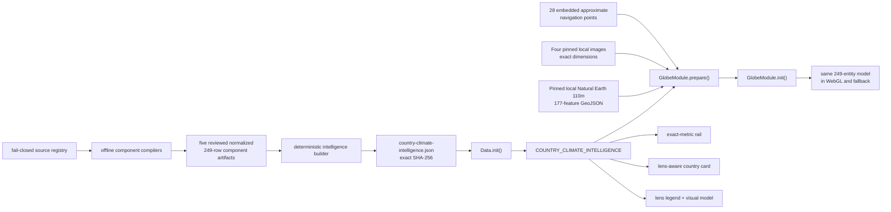

# Earth Love United — v1 Architecture Map

> Read this before changing runtime code. `AGENTS.md` contains the rules;
> this file records the live module graph, data flow, stacking model, and
> extension points.

**Runtime baseline:** 2026-08-25 Country Climate Intelligence factual candidate
**Architecture:** one HTML page, classic scripts, no bundler or browser build

## Public surface

`index.html` owns the public journey:

```text
site navigation
  → hero and live carbon clock
  → foundation story and projects
  → living-globe explanation
  → carbon services
  → partners, open-source commitment, team, tribute, contact

hero / Living Globe action
  → App.enterGlobe()
  → lazy-load globe.gl
  → initialize GlobeModule
  → resume the renderer only while the live globe route is visible
  → first visit opens the three-move Climate Intelligence first orbit
  → Carbon / Power / Physical lens controls
  → exact-metric country rail + lens-aware selected-country card
  → App.exitGlobe() pauses WebGL and returns to the foundation page
```

The former GAIA, quiz, biome, scenario, pledge-wall, declarative-learning,
NDVI, and event-globe systems are parked in `_archive/v1-cut/`. They are not
runtime dependencies and must not be resurrected without an architecture
mission.

## Runtime file map

| Layer | File | Responsibility |
|---|---|---|
| Page | `index.html` | Critical tokens/layout, public copy, DOM, script order, theme bootstrap |
| Globe presentation | `css/globe-system.css` | Globe HUD, atlas rail/card, status visuals, themes, responsive behavior |
| Globe orientation | `css/guided-first-orbit.css` | Three-move lens guide, compact selection key, deck-move shelf, replay control |
| Clock presentation | `css/carbon-clock.css` | Carbon-clock typography and layout |
| Safety utilities | `js/gaia-utils.js` | Safe DOM access, cross-module calls, safe fluent chains, error reporting |
| Contract registry | `js/module-contracts.js` | Module interfaces, dependencies, events, runtime pre-flight validation |
| Event bus | `js/event-bus.js` | Decoupled runtime events |
| Persistence | `js/storage-adapter.js` | IndexedDB adapter and migrations |
| Persistence facade | `js/storage.js` | Safe storage API over `STORAGE_ADAPTER` |
| Data validation | `js/data-schema.js` | Runtime JSON validation |
| Data loader | `js/data.js` | Exact-SHA Country Climate Intelligence loading and 249-entity lookups |
| Climate view model | `js/country-climate-intelligence.js` | Lens selection policy, cached compact renderer visuals, rail rows, country facts, legend, gaps, provenance, and disclosed query-only visual experiments |
| Globe runtime | `js/globe.js` | globe.gl lifecycle, country geometry, atlas rail/card, lens rendering, selection, themes, and the 120 Hz scene budget |
| Carbon clock | `js/carbon-clock.js` | Hero/topbar emissions counter |
| Globe orientation | `js/guided-first-orbit.js` | Three-move Climate Intelligence tutorial, real country/deck handoff, completion preference, replay |
| Application | `js/app.js` | Bootstrap, contract pre-flight, hero/globe transitions, lazy globe load |
| Offline cache | `sw.js` | Static precache and network-first data/code updates |

## Script load order

The twelve classic scripts load synchronously at the end of `index.html`:

```text
1.  js/gaia-utils.js
2.  js/module-contracts.js
3.  js/event-bus.js
4.  js/storage-adapter.js
5.  js/storage.js
6.  js/data-schema.js
7.  js/data.js
8.  js/country-climate-intelligence.js
9.  js/globe.js
10. js/carbon-clock.js
11. js/guided-first-orbit.js
12. js/app.js
```

`js/vendor/globe.gl.js` is loaded by `App.enterGlobe()` rather than at page
boot. This keeps WebGL work out of the foundation-page path.

After changing scripts or contracts, run:

```bash
python3 scripts/verify_load_order.py
```

The verifier parses script tags, `window.X` assignments, and
`MODULE_CONTRACTS.register()` declarations. It is the static module graph
authority; there is no separate `MODULE_MANIFEST`.

## Module registry

Any API reached through `safeCall()`, `safeGet()`, or `hasModule()` must exist
on `window`.

| Global | File | Contract | Main responsibility |
|---|---|---:|---|
| `MODULE_CONTRACTS` | `js/module-contracts.js` | registry itself | Runtime interface/dependency validation |
| `EventBus` | `js/event-bus.js` | infrastructure | Publish/subscribe |
| `STORAGE_ADAPTER` | `js/storage-adapter.js` | yes | IndexedDB persistence |
| `Storage` | `js/storage.js` | yes | Safe persistence facade |
| `DATA_SCHEMA` | `js/data-schema.js` | yes | Runtime data validation |
| `Data` | `js/data.js` | yes | Data load and country lookups |
| `COUNTRY_CLIMATE_INTELLIGENCE` | `js/country-climate-intelligence.js` | yes | Metric/lens presentation contract, scientific selection boundary, and relief direction disclosure |
| `GlobeModule` | `js/globe.js` | yes | Live globe and country atlas |
| `Panel` | `js/globe.js` | legacy internal export | Archived-site fallback helpers; not part of current public flow |
| `PanelSlider` | `js/globe.js` | legacy internal export | Archived-site fallback helpers |
| `CARBON_CLOCK` | `js/carbon-clock.js` | yes | Live counter |
| `GUIDED_ORBIT` | `js/guided-first-orbit.js` | yes | Three-move Climate Intelligence orientation and replay |
| `App` | `js/app.js` | yes | Bootstrap and navigation |

`App.init()` calls `MODULE_CONTRACTS.validate()` after `Data.init()`. A
registered module must exist on `window`, expose every declared method, and
have its required globals available. Contract errors use `reportError()`.

## Standard module shape

New orchestration/evaluation modules use a classic-script global API:

```javascript
const COUNTRY_PROFILE = (() => {
  function init() {}
  function reset() { return true; }
  function destroy() { return true; }
  function getState() { return {}; }

  return { init, reset, destroy, getState };
})();

window.COUNTRY_PROFILE = COUNTRY_PROFILE;

MODULE_CONTRACTS.register('COUNTRY_PROFILE', {
  provides: ['init', 'reset', 'destroy', 'getState'],
  requires: ['Data'],
  emits: [],
  listens: [],
});
```

Add its script tag after dependencies, run the static verifier, run
`node --check`, and extend `SmokeTest` coverage. Do not place additional
evaluation policy directly into `js/globe.js`; the globe consumes a reviewed
view model.

## Data flow

### Current v1 flow


```mermaid
flowchart LR
    SR["fail-closed source registry"] --> C["offline component compilers"]
    C --> F["five reviewed normalized<br/>249-row component artifacts"]
    F --> X["deterministic intelligence builder"]
    X --> J["country-climate-intelligence.json<br/>exact SHA-256"]
    J --> D["Data.init()"]
    D --> M["COUNTRY_CLIMATE_INTELLIGENCE"]
    M --> P["GlobeModule.prepare()"]
    N["Pinned local Natural Earth 110m<br/>177-feature GeoJSON"] --> P
    I["Four pinned local images<br/>exact dimensions"] --> P
    PTS["28 embedded approximate<br/>navigation points"] --> P
    P --> G["GlobeModule.init()"]
    M --> R["exact-metric rail"]
    M --> K["lens-aware country card"]
    M --> V["lens legend + visual model"]
    G --> B["same 249-entity model<br/>in WebGL and fallback"]
```

`Data.init()` gives the essential Country Climate Intelligence runtime a bounded 60-second first-transfer deadline. The runtime still fails closed on timeout, HTTP failure, checksum drift, schema drift, or missing WebCrypto, but normal slow links are not converted into an empty evidence fallback. Headless CI holds the first response for 8.5 seconds with service workers disabled and requires all 249 entities to remain available.
The candidate is parsed only after WebCrypto verifies SHA-256
`d961610b1786b82755ecca266e20236f5ad13e0d5df25dd8345703fd50a41728`.
Schema validation then proves 249 unique registry entities, exactly 27 metric
records per entity, coverage derived from records, three complete lens
partitions, explicit gaps, and the non-production release boundary. Candidate
failure blocks 3D rendering and exposes no inferred climate values.

The three public comparison partitions are Carbon 213/36, Power 195/54, and
Physical 245/4. `COUNTRY_CLIMATE_INTELLIGENCE` owns scientific selection,
comparison eligibility, evidence/gap copy, source presentation, legend data,
and the visual model. `GlobeModule` owns rendering and interaction and must not
reimplement those policies. All three lenses use redundant color and raised
country-tile height for their exact comparison metric: Carbon is log-scaled,
Power is bounded linear over 0–100% clean share, and Physical is linear over the
published warming range. Physical relief is projected warming only—not
vulnerability, damage, or responsibility.

The Power card renders one static generation field from the exact 2024 Ember
share facts. Two aligned 0–100% tracks copy the clean and fossil aggregates;
each track is subdivided by Ember's nine standardized generation-fuel rows:
Bioenergy, Coal, Gas, Hydro, Nuclear, Other Fossil, Other Renewables, Solar,
and Wind. Nuclear and the purple-pink `Other Renewables` bucket use plain color;
hydro, wind, solar, bioenergy, coal, gas, and `Other Fossil` use restrained,
fuel-specific static textures. Fixed fuel ordering plus the two-column
text/value legend provide the non-color reading route, while hatching is
reserved for explicit gaps. The view model requires a
shared period, actual evidence class, source, fuel group, and taxonomy before
drawing a segment. Blank cells remain
labelled data gaps, source zeroes remain zero, and 99.98–100.02 totals are
disclosed as source rounding. No browser normalization is allowed. `Other
Renewables` is explicitly Ember's combined geothermal, tidal, and wave bucket,
not a geothermal-only value. The field is neither a new ranking metric nor a
whole-economy assessment. All represented fuel facts are visually
de-duplicated from generic fact grids but remain in the methods drawer.

The Physical card separately renders the compiled 1970–2025 ERA5 annual
temperature and precipitation series and supplied OLS endpoints for 245 entities. It groups
observed temperature analysis, an evidence-only published projection range, and the unchanged
projected-temperature fact before the projected-precipitation fact and observed precipitation
data. `COUNTRY_CLIMATE_INTELLIGENCE` copies the published SSP2-4.5 p10, median, and p90
without fitting a distribution or generating samples. The renderer distinguishes the three
statistics with square, diamond, and circle markers and draws no path through intervening
years. These views do not affect the Physical comparison order, which remains
the exact SSP2-4.5 modeled projection metric. At-a-glance, observed-series, and projected
fact IDs are removed from the expanded lens grid while all facts remain in the methods
drawer, so the renderer never duplicates a headline fact card.

### Globe performance boundary

The live renderer targets a 120 Hz-capable display budget of 8.333 ms per
frame. This is a scene and interaction budget, not a claim that a 60 Hz panel
or a browser throttled by the operating system will report 120 frames per
second. `GlobeModule.getPerformanceState()` exposes the declared target,
renderer pixel ratio, draw calls, triangles, geometries, textures, and warmed
lens-deck count so browser smoke tests can reject accidental scene inflation.

`COUNTRY_CLIMATE_INTELLIGENCE` memoizes ranks, compact renderer visuals, rail
rows, and legends per lens. Polygon accessors consume `getCountryVisual()` and
never construct the analyst-grade country-card model. During preparation,
`GlobeModule` warms the Carbon, Power, and Physical navigation decks; lens
switches reuse those arrays instead of sorting 201 entities in a rendered
frame. Hover and selection refresh only the country outline. Rebinding cap,
side, and altitude accessors is reserved for a real lens change because it
rebuilds every extruded country mesh.

The renderer requests the high-performance GPU path, retains device pixel
ratio up to the tested 2× boundary, and uses 8° cap curvature for the
generalized Natural Earth 1:110m geometry. Hover-card positioning uses its
known CSS envelope plus `ResizeObserver`; pointer movement must not read
`offsetWidth` or `offsetHeight` after replacing tooltip content. Current smoke
limits are 1,600 draw calls, 90,000 triangles, 650 geometries, four textures,
and exactly three warmed lens decks.

Before loading globe.gl, `GlobeModule.prepare()` must preload and validate the
local 177-feature GeoJSON plus all four local globe visuals. The dark surface is
a byte-for-byte 3600×1800 NASA Earth Observatory Black Marble 2012 JPEG; the
4096×2048 sky restores the original Three-Globe 2.45.2 PNG as an exact,
locally pinned decorative asset and is not astronomical evidence.
Preparation validates exact image dimensions and strong Polygon/MultiPolygon
structure. The 28 approximate small-state points are embedded navigation
affordances pinned to a hashed manual source; disputed subfeatures and
non-registry entities are excluded. The interactive geometry deck resolves
exactly 201 registry entities. The first-class evidence browser remains the
route to all 249 entities and renders the active lens's same ordered/gap
partition. Geometry availability never determines factual eligibility.

The deploy surface also exposes `/THIRD_PARTY_NOTICES.txt` from the origin
root and retains its machine inventory under `data/governance/vendor/`. The
notice checker pins the source and final staged bytes, integration record, and
future approval schema. A protected, exact-hash trust registry is currently
empty and `unprovisioned`; approval and detached signature artifacts are absent.
Notice integrity does not confer rights approval: the inventory core flags are
historical inventory-only properties, and production requires five
asset-specific rights dispositions plus four counsel resolutions in an exact
commit approval, followed by distinct verified Ed25519 signatures from the
asset-rights reviewer, licensing counsel, and release authorizer.

The implemented data contract is documented in:

- `docs/COUNTRY-CLIMATE-TRUTH-PLAN.md`
- `docs/COUNTRY-CLIMATE-METHODOLOGY.md`

The browser remains static. Fetching, normalization, review, and compilation
are publication tasks, not a frontend build.

## Current country-selection flow

```text
App.enterGlobe()
  → show loading state and enter globe mode
  → COUNTRY_CLIMATE_INTELLIGENCE.init()
  → GlobeModule.prepare()
      ├─ candidate unavailable → #globe-fallback (candidate_data_unavailable)
      ├─ geometry invalid/unavailable → #globe-fallback (country_geometry_unavailable)
      └─ image invalid/unavailable → #globe-fallback (visual_assets_unavailable)
  → lazy-load verified local js/vendor/globe.gl.js
      └─ load failure → show body-level #globe-fallback evidence view
  → GlobeModule.init()
      ├─ missing WebGL / constructor failure → show #globe-fallback; return false
      → create globe.gl instance through safeChain()
      → activate prepared geometry and exact 201-entity deck
      → emit globe:render-ready / globe:country-data-ready
  → set Carbon as the initial lens
  → leave country selection empty until the user chooses an entity

Carbon / Power / Physical lens selection
  → GlobeModule.setLens(id)
  → COUNTRY_CLIMATE_INTELLIGENCE supplies the exact rail, legend, card, and visual model
  → preserve the selected country while rebuilding the lens view
  → emit globe:lens-changed
  → if fallback is open, rebuild its list and detail with the same active lens

Browse all 249 evidence records
  → requires initialized renderer + exactly one live canvas
  → show #globe-fallback in evidence_browse_requested mode
  → search/select factual series or explicit source gaps
  → keep the global lens controls and tutorial operable beside the non-modal evidence region
  → Close/Escape validates the renderer again before returning

pointer or keyboard selection
  → select country feature
  → renderCountryTooltip()
  → renderCountryMetrics()
  → expose a non-modal labelled evidence dialog so the lens controls remain reachable
  → keep the country name, evidence class, and Close control sticky inside the card scrollport
  → emit globe:country-selected

country-card swipe / previous-next / arrow keys / horizontal trackpad
  → GlobeModule.navigateCountry(dir, { source })
  → keep the active lens order and replace the selected evidence card
  → emit globe:country-selected for the new record
  → emit globe:country-navigated with from/to identity, direction, and interaction source

first globe visit / replay
  → GUIDED_ORBIT.start()
  → candidate_data_unavailable suppresses the tour instead of exposing an unfinishable empty route
  → explain the three separate lenses and no-single-score boundary
  → point visually to the lens controls and lens-ordered rail, then release both for one country choice
  → globe:country-selected moves the tutorial opposite the evidence card and cues one horizontal card move
  → globe:country-navigated completes the orbit; swipe, buttons, arrow keys, and trackpad keep accessible parity
  → globe:country-closed returns the deck moment to country selection
  → fallback users complete the same third moment by choosing one more evidence record
  → completion or dismissal persists locally; toolbar orbit control replays

Escape / close / App.exitGlobe()
  → clear selection
  → pause the globe.gl animation loop without destroying the prepared renderer
  → emit globe:country-closed / app:globe-exited

Document visibility / evidence browser
  → pause WebGL while the tab or 3D surface is hidden
  → resume the existing renderer only when the visible globe route returns
```

## Event channels

| Event | Emitter | Listener/consumer |
|---|---|---|
| `app:ready` | `App` | External/optional listeners |
| `app:globe-entered` | `App` | External/optional listeners |
| `app:globe-exited` | `App` | External/optional listeners |
| `climate-intelligence:ready` | `COUNTRY_CLIMATE_INTELLIGENCE` | External/optional listeners |
| `globe:render-ready` | `GlobeModule` | `App` loading state |
| `globe:country-data-ready` | `GlobeModule` | `App` loading state |
| `globe:data-error` | `GlobeModule` | `App` user-visible loading/error state |
| `globe:fallback-shown` | `GlobeModule` | `App` loading and `aria-busy` state |
| `globe:fallback-hidden` | `GlobeModule` | `GUIDED_ORBIT` route and selection-step recovery |
| `globe:country-selected` | `GlobeModule` | External/optional listeners |
| `globe:country-navigated` | `GlobeModule` | `GUIDED_ORBIT` swipe/deck completion |
| `globe:country-closed` | `GlobeModule` | External/optional listeners |
| `globe:lens-changed` | `GlobeModule` | External/optional listeners |
| `guided-orbit:started` | `GUIDED_ORBIT` | External/optional listeners |
| `guided-orbit:step` | `GUIDED_ORBIT` | External/optional listeners |
| `guided-orbit:completed` | `GUIDED_ORBIT` | External/optional listeners |
| `guided-orbit:dismissed` | `GUIDED_ORBIT` | External/optional listeners |

Event names use an emitter prefix (`module:verb`). Contracts declare emitted
and listened-to channels so pre-flight can flag orphan listeners.

## Z-index stack

Top to bottom:

```text
9999  .skip-nav while focused
1100  #guided-orbit
1000  #hex-country-tooltip, .country-atlas-card
 300  #site-nav
 200  #hero, #globe-back-btn
 110  .globe-status
 100  #topbar
  80  .climate-lens-controls
  60  #globe-fallback (failure or user-invoked evidence browser), .hex-legend
  50  .country-atlas-rail
  20  .country-atlas-scrim
  10  .sections, .footer
   1  #globeViz
```

Rules:

1. Interactive overlays belong under `document.body`, not inside `#globeViz`.
2. Invisible/off-screen UI must disable pointer events.
3. A transformed element creates a stacking context.
4. `#globeViz` becomes interactive only in `body.globe-mode`.
5. Any z-index change requires `StackLint.audit()` and an update to this table.
6. `#globe-fallback` is a direct child of `body` and a labelled non-modal
   evidence region. While active it disables the globe canvas, country
   rail/card, legend, loader, and duplicate global back control; the shared
   lens controls, tutorial, retry/Foundation actions, and factual/gap list
   remain usable.

## Service worker and freshness

`sw.js` cache epoch v69 precaches the public page, core CSS/JS, the refined
three-move Climate Intelligence first orbit with separately spaced visual cue lanes and runtime-enforced compact lens/card air, the shared raised-tile lenses, evidence-only
Physical-card percentile range, the simplified two-track Power fuel palette,
verified local globe.gl, the CT-45 manifest and localized globe assets, the
scroll-proof non-modal selected-country identity header, and the exact-version
Country Climate Intelligence candidate. The prior
country-factual candidate is retained for one release
epoch as a rollback artifact; it is not loaded into the v1 dashboard. The
renderer retains full device-pixel density through DPR 2; multisample
antialiasing remains enabled below DPR 1.5 and is disabled at Retina density.
The same atomic epoch carries the 60-second essential-runtime boundary and
generation-cancelled country navigation, so stale cached code cannot reopen a
card after Escape or pair the new loader with an old deadline. Native Retina
pixel coverage preserves edges without repeating the fragment
work that breaks the 8.333 ms / 120 FPS interaction budget. The
service worker applies:

- network-first for `/data/`;
- network-first with browser-cache bypass for HTML, JS, and CSS;
- cache-first for other same-origin static assets. Geometry and visual-asset requests
  use digest-versioned query keys coupled to the precache entries.

Any runtime data filename or script addition requires an atomic service-worker
asset, query pin, and cache-epoch review. A reviewed release must not pair new
HTML or code with an old runtime artifact.

## Validation layers

| Layer | Tool | What it proves |
|---|---|---|
| Syntax | `node --check` | JavaScript parses |
| Static module graph | `python3 scripts/verify_load_order.py` | Contract dependencies load in order |
| Runtime contracts | `MODULE_CONTRACTS.validate()` | Registered globals and methods exist |
| Runtime behavior | `SmokeTest.run()` | Modules, data, DOM, globe, and selected interactions work |
| Stacking | `StackLint.audit()` | No known invisible blockers/z-index regressions |
| Country intelligence aggregate | `node tools/check-country-climate-intelligence-ci.js` | Registry gates, exact component receipts, compiler derivations, 249×27 runtime, lens coverage, UI contract, and atomic pin agree |
| CCI public-release exclusion | `node tools/check-country-climate-public-release-boundary.js` | Unapproved CCI values exist only in the marked local candidate artifact surface; factual-public staging omits them |
| WebGL/fallback parity | `node tools/check-globe-webgl-fallback.js` | Three lenses share the 249-entity evidence model and explicit gaps |
| Country truth | `tools/verify-globe-country-truth.js` | Intended country-status invariants; currently requires repair for v1 |
| Public copy | `node tools/check-public-copy.js` | No unresolved draft markers; not scientific fact-checking |
| Third-party notices | `node tools/check-globe-third-party-notices.js` | Exact notice/inventory/integration bytes and active deploy/CI controls; no rights approval |
| Approval authority | `node tools/check-globe-runtime-approval.js` | Empty trust is fail closed; future detached three-role Ed25519 signatures and bindings verify |
| Final staged aggregate | `node tools/check-staged-production-integrity.js --staged _deploy` | Last-write rehash of CT-45, notices, trust, footer, and any signed approval pair |

CI runs the existing governance and production-denial gates plus the v1
Country Climate Intelligence aggregate, syntax, static load order, SmokeTest,
StackLint, theme/responsive checks, and WebGL/fallback parity. Passing those
checks validates a factual candidate; it does not satisfy the independent
scientific-review or production-promotion gates.

The exact public artifact allowlist treats
`data/climate/runtime/country-climate-intelligence.json` as candidate-only.
The factual-public gate still evaluates its historically reviewed CT-42 facts,
but refuses to stage the current browser entrypoints while they reference the
candidate-only CCI file. This preserves the last deployed release instead of
publishing missing essential data. A new data/UI/source-rights/scientific-review
chain must replace the current false promotion flags before CCI moves onto that
surface.

## Known traps and debt

| Trap/debt | Consequence | Direction |
|---|---|---|
| `const X` without `window.X` | `safeCall()` cannot see the module | Export every cross-module API |
| Scientific policy added to `js/globe.js` | Renderer and evidence semantics can silently diverge | Keep eligibility, gaps, provenance, and visual models in `COUNTRY_CLIMATE_INTELLIGENCE` |
| Missing upstream row treated as zero | Gaps become false measurements | Compile an enumerated gap or documented mapping exception |
| Cross-source delta without exact scope equality | Accounting-frame differences look like disagreement | Require an identical scope fingerprint before computing a delta |
| Raw snapshot retained in Git | Redistribution and repository-size risk | Keep raw files external; commit receipts, logs, reviewed normalized facts, and the compact runtime only |
| Color alone conveys a lens value | Low vision and grayscale users lose the evidence class | Pair color with metric text, units, period, ordering, and explicit gap copy |
| Geometry used as factual eligibility | Small states disappear from the dashboard | Keep the 249-entity evidence browser authoritative |
| Archived subsystems copied into v1 | Reintroduces dead dependencies | Architecture review before restoration |

## Before shipping

```bash
python3 scripts/verify_load_order.py
node tools/check-country-climate-intelligence-ci.js
node tools/check-globe-webgl-fallback.js
node --check js/changed-file.js
node tools/check-public-copy.js
node tools/check-globe-third-party-notices.js
```

Then serve the site and run:

```text
SmokeTest.run()
StackLint.audit()
```

For Country Climate Intelligence releases, also require the methodology,
provenance, comparability, golden-country, coverage, visual-truth,
change-control, and independent-review gates in
`docs/COUNTRY-CLIMATE-TRUTH-PLAN.md`.
