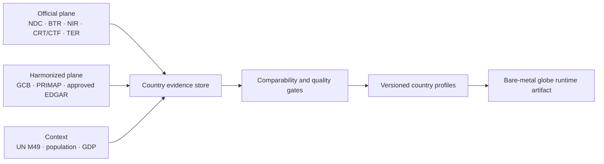
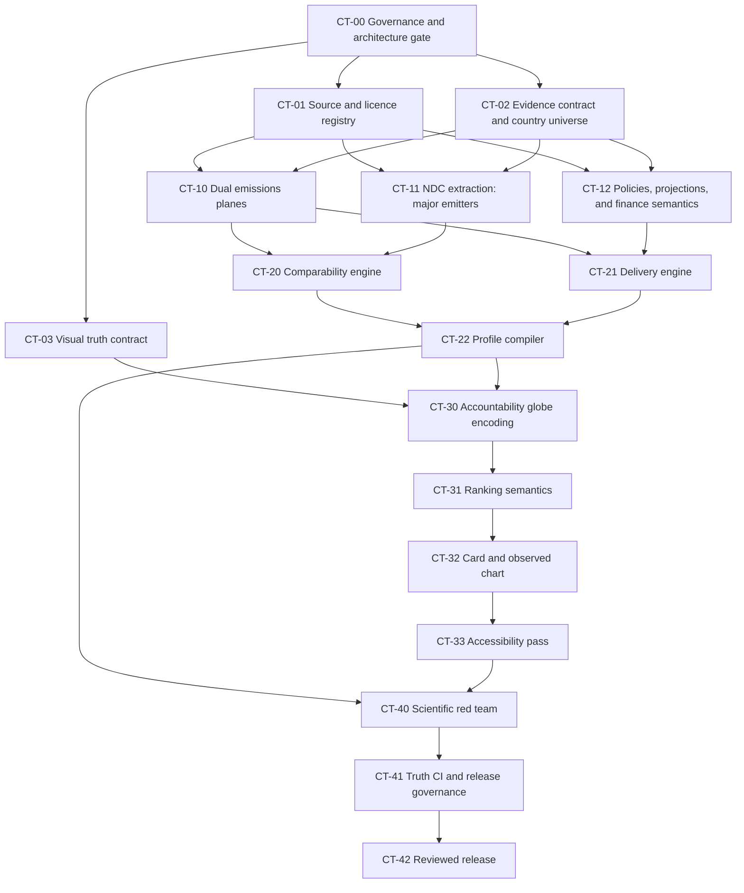

# Country Climate Truth — Agentic Delivery Plan

**Status:** Proposed for execution

**Prepared:** 2026-07-15

**Scope:** Country data, commitments, climate-performance evaluation, globe encoding, country cards, ranking, provenance, and release verification.

## Outcome

Replace the current pledge-gap presentation with a reproducible **Country Climate Profile** that makes five different questions visible without collapsing them into one opaque score:

1. **Impact** — how consequential the country's emissions footprint is.
2. **Target integrity and ambition** — what the country committed to, whether it is comparable, and how adequate it is.
3. **Delivery** — whether measured emissions and implemented policies are moving at the pace required.
4. **Fair contribution** — responsibility, capability, and climate support, kept distinct from domestic delivery.
5. **Evidence quality** — how current, complete, comparable, and reproducible the assessment is.

The first release milestone is not “every country has a score.” It is:

> Every mapped country has a truthful evidence state; every high-impact country remains visually consequential; only comparable evidence receives a performance assessment.

## Non-negotiable rules

- Missing, stale, or non-comparable evidence never becomes `0`, `false`, neutral performance, or green.
- A country can have a target without having a target that can be converted into an absolute emissions level.
- Official Party-reported information and harmonized scientific estimates remain separate evidence planes.
- Every derived value records its input facts, accounting scope, formula, methodology version, and source release.
- Fossil CO2, economy-wide GHG, and LULUCF are not silently mixed.
- Conditional and unconditional commitments are separate target records.
- Climate projects and carbon-market activity do not offset or soften the national performance assessment.
- Adaptation and vulnerability are a separate profile; limited reporting capacity is not treated as climate failure.
- The public site remains bare-metal. Data preparation is an offline publication pipeline, not a browser build step.

## Decisions required at Gate 0

The architect mission will recommend defaults, but these choices require explicit approval before public scoring:

| Decision | Recommended starting position |
|---|---|
| Country universe | All UN M49 entities, with ISO, UN membership, UNFCCC Party, LDC, SIDS, territory, and geometry flags |
| Public result | Multi-axis categorical profile; no 0–100 composite in the first release |
| Comparative emissions | Harmonized economy-wide GHG series, with fossil CO2 and LULUCF shown separately |
| Accountability record | Official UNFCCC inventory alongside, never overwriting the harmonized series |
| Missing/non-comparable target | Explicit reason code; no performance band |
| Finance | Separate fair-contribution/support axis, not a substitute for domestic mitigation |
| Adaptation/vulnerability | Separate future profile, not a mitigation penalty |
| Restricted data licences | No ingestion or redistribution until reuse terms are approved |

There is also an architecture gate: the current runtime has been reduced to a small v1 system, while `ARCHITECTURE.md` and the module-validation rules describe an older system. A new evaluation module must not be added until the architect and reviewer decide whether to restore the validator/manifest or formally update the architecture contract.

## Evidence architecture

### Two evidence planes



- **Official plane:** answers “What did the country report?”
- **Harmonized plane:** answers “What does one comparable global method estimate?”
- Disagreement between the planes is an evidence flag to investigate and display, not a value to silently reconcile.

### Source hierarchy

| Domain | Source of record | Comparison or fallback layer |
|---|---|---|
| Identity | [UN M49](https://unstats.un.org/unsd/methodology/m49/) | Reviewed local geometry and name aliases |
| Official inventories and progress | [UNFCCC BTR submissions](https://unfccc.int/biennial-transparency-reports) and [UNFCCC Reports](https://unfccc.int/reports) | Older BURs, National Communications, and official national inventories |
| NDC commitments | [UNFCCC NDC Registry](https://unfccc.int/NDCREG) | BTR tracking tables; Climate Watch may assist discovery/translation but not replace the original document |
| Comparable fossil and land-use CO2 | [Global Carbon Budget 2025](https://globalcarbonbudget.org/datahub/the-latest-gcb-data-2025/) | Source-specific uncertainty retained |
| Comparable economy-wide GHG history | [PRIMAP-hist v2.7](https://zenodo.org/records/17090760) | [EDGAR 2025](https://edgar.jrc.ec.europa.eu/dataset_ghg2025) only after licence review |
| Independent ambition and policy assessment | [Climate Action Tracker methodology](https://climateactiontracker.org/methodology/cat-rating-methodology/) | Preserve limited coverage as `not_independently_assessed` |
| Population and economic denominators | [UN World Population Prospects](https://population.un.org/wpp/) and [World Bank Indicators API](https://datahelpdesk.worldbank.org/knowledgebase/articles/898581-api-basic-call-structures) | Years and price bases must match the calculation |
| Finance | UNFCCC financial CTFs | OECD activity-level records and fund-specific records, with provided/mobilized/needed/received kept distinct |

Global Carbon Budget, PRIMAP, EDGAR, CAT, IEA, and other secondary datasets require a recorded licence and attribution decision before their values are redistributed. Large raw source files stay in approved external versioned storage; this repository keeps manifests, checksums, normalized evidence, and reproducible retrieval instructions.

### Evidence record

Each observation must carry at least:

```text
fact_id
country_id / M49 / ISO3
metric, value, unit, period
gas basket and GWP basis
sector coverage and LULUCF treatment
territorial/consumption boundary
international bunkers treatment

publisher, document/dataset title, version
publication/submission date, retrieval date
direct URL or DOI, page/table/cell locator
checksum, licence, required attribution

evidence class: official | harmonized | derived | modeled | proxy
transformation and input fact IDs
uncertainty/confidence and quality flags
review status, reviewer, review date
supersedes fact ID
```

Targets additionally require target type, target/reference years, base or BAU value, reduction range, gases, sectors, LULUCF, conditionality, market mechanisms, native target text, normalized estimate, comparability state, and non-comparability reason.

### Required evidence states

```text
available                 estimated
modeled                   not_reported
not_assessed              non_comparable
not_applicable            not_yet_due
stale                     conflicting
withheld                  source_unavailable
reporting_optional        not_reviewed
```

Target-specific reasons include `baseline_not_quantified`, `denominator_missing`, `scope_mismatch`, `lulucf_treatment_unknown`, `conditionality_unknown`, and `independent_benchmark_unavailable`.

## Evaluation contract

### Public profile

| Axis | Question | Output |
|---|---|---|
| Impact | How large is the footprint? | Very high to low; contextual, not a performance grade |
| Target integrity | Is the commitment sufficiently specified? | Comparable, partial, non-comparable, absent |
| Ambition | Is the comparable commitment aligned with domestic and fair-share benchmarks? | Aligned to critically insufficient, or not assessed |
| Delivery | Are observed emissions and policies moving at the required pace? | Ahead, on pace, uncertain, off course, not assessed |
| Fair contribution | How do responsibility, capability, and support relate? | Separate categorical/context assessment |
| Evidence | How trustworthy and reproducible is the profile? | A–D plus explicit flags |

A compact headline may read: **High impact · Insufficient ambition · Off-course delivery · Evidence A**. An overall performance band is withheld when ambition or delivery fails the evidence/comparability gate.

The framework follows the progression, transparency, ambition, and differentiated-responsibility principles in [Paris Agreement Article 4](https://unfccc.int/sites/default/files/parisagreement_publication.pdf). It keeps target ambition, policies/action, and fair-share assessments distinct, consistent with the [CAT rating methodology](https://climateactiontracker.org/methodology/cat-rating-methodology/) and the separation between NDC and current-policy outcomes in the [UNEP Emissions Gap Report 2025](https://www.unep.org/resources/emissions-gap-report-2025).

### Target comparability gate

An absolute target and gap may be calculated only when these are known and compatible:

1. Target and reference year or period.
2. Reference value or reproducible baseline.
3. Gas basket and GWP convention.
4. Sector and geographic coverage.
5. LULUCF and removals treatment.
6. Conditional and unconditional portions.
7. Article 6 transfer treatment.
8. Primary source and methodological assumptions.

BAU targets require the actual published BAU scenario. Intensity targets require the stated denominator and compatible observed/projected denominator. Sectoral, qualitative, peaking, and net-zero targets retain their native structure when they cannot support an economy-wide calculation.

### Delivery calculation

For a comparable target:

```text
required_rate =
  (target_emissions / latest_emissions) ^
  (1 / (target_year - latest_year)) - 1
```

Recent pace uses a measured, scope-matched annual series with at least six observations and an uncertainty interval. It is labelled **recent pace versus required pace**, not a prediction.

- **On pace:** observed-rate interval is at least as fast as required.
- **Off course:** the complete observed interval is slower than required.
- **Uncertain:** intervals overlap.
- **Not assessed:** evidence is insufficient or incompatible.

Where an independent current-policy projection exists, it forms a separate delivery test.

## Visualization contract

### Default globe: Accountability

- Absolute annual emissions remain persistently visible through log-scaled polygon height and a labelled sequential magnitude treatment.
- Progress appears as a separate border/status treatment only when comparable.
- Target adequacy is a separate card axis and optional lens.
- Evidence quality uses text, icon, and reason codes—not low opacity, which would reward missing information.
- Green is reserved for a comparable assessment that passes the approved progress rule.
- “No target” is replaced by `No documented target`, `Target not comparable`, `Progress not assessable`, or `Country data missing`.
- Optional lenses may expose Emissions, Target adequacy, Progress, and Evidence without changing the persistent impact cue.

### Ranking rail

- Default: **Largest annual emitters**, consistently sorted across countries with emissions evidence.
- Optional: **Pledge overshoot**, containing only scope-comparable countries and declaring its eligible denominator.
- Unknown or non-comparable countries are unnumbered; they are never alphabetically appended to a numeric ranking.
- Each row states emissions magnitude and assessment status in text. Color is supplementary.

### Country card

1. **Responsibility:** latest emissions, observation year, global share, per-capita and historical context where supported.
2. **Commitment:** target type, scope, baseline, year, conditionality, comparability, and independent adequacy.
3. **Progress:** observed change, required pace, current pace, and level gap as distinct concepts.
4. **Evidence:** sources, source dates, coverage, confidence, conflicts, and missing fields.
5. **Projects and markets:** separated and labelled “not part of the national performance profile.”

The chart uses measured annual points only. A comparable target may add conditional/unconditional endpoints and a clearly labelled illustrative required pathway. It uses real years, labelled axes and units, an SVG title/description, and an accessible textual summary.

Status cannot rely on color alone, following [WCAG 2.2 Use of Color](https://www.w3.org/WAI/WCAG22/Understanding/use-of-color) and [Non-text Contrast](https://www.w3.org/WAI/WCAG22/Understanding/non-text-contrast.html).

## Agent operating model

- One coordinator plus at most three parallel worker agents.
- Every mission starts through `tools/start-mission.sh` on `agent/<role>/<slug>` and finishes through `tools/end-mission.sh`.
- Data acquisition agents write isolated evidence batches; they never edit the shared generated runtime artifact.
- One compiler mission owns generated aggregate files.
- A target interpretation is reviewed by an agent who did not extract it.
- Missions sharing `js/globe.js` run sequentially.
- Protected-file changes receive their own PR and human architectural review.
- Every PR remains below 20 changed files unless explicitly reviewed.
- Source polling creates staged candidates only. Nothing publishes without validation and review.

## Mission graph



## Mission briefs

### Wave 0 — Decisions and contracts

| ID / branch slug | Role | Deliverable and likely files | Gate |
|---|---|---|---|
| **CT-00 `climate-truth-governance`** | Architect | Public methodology charter, score/profile decision, accounting decision, and v1 contract/static-verifier architecture reconciliation | Human approves Gate 0; protected changes reviewed |
| **CT-01 `climate-source-registry`** | Generalist/reviewer | Versioned source/licence/attribution registry and storage rules | Every proposed source has explicit reuse status and retrieval path |
| **CT-02 `country-evidence-contract`** | Architect/generalist | Canonical country registry, observation/target schema, enums, valid/invalid fixtures, schema validator | Unknown cannot validate as zero/false; every canonical entity has a state |
| **CT-03 `country-visual-contract`** | Designer | Non-runtime visual specification and golden UI fixtures for major-emitter, missing, non-comparable, and conflicting cases | Science/data sign-off before runtime styling |

CT-01, CT-02, and CT-03 can run in parallel after CT-00's decisions are recorded.

### Wave 1 — Evidence acquisition

| ID / branch slug | Role | Deliverable | Gate |
|---|---|---|---|
| **CT-10 `country-emissions-evidence`** | Generalist | Separate official and harmonized annual emissions series with scopes, uncertainty, release manifests, and anomaly report | No silent reconciliation; top emitters and coverage totals reviewed |
| **CT-11 `major-emitter-ndc-evidence`** | Generalist + independent reviewer | Primary-source NDC evidence for the top 20 emitters, starting with China, India, Indonesia, Iran, and other current “No target” cases | Every target type passes required-field rules or receives an exact non-comparability reason |
| **CT-12 `country-policy-finance-evidence`** | Generalist | BTR policy/projection pilot for the top 30 emitters; replace ambiguous `finance_total_bn` semantics with typed provided/mobilized/needed/received records | Policy projection and finance claims have primary sources and explicit types |

Remaining NDCs are processed later in isolated batches of 15–20 countries, each independently reviewed. These agents write evidence packets; they do not edit the final profile JSON.

### Wave 2 — Evaluation engine and compiler

| ID / branch slug | Role | Deliverable | Gate |
|---|---|---|---|
| **CT-20 `target-comparability-engine`** | Generalist | Pure target normalization/comparability rules and fixtures for base-year, BAU, intensity, fixed-level, trajectory, sectoral, conditional, net-zero, and LULUCF-heavy targets | Incompatible targets fail closed with a reason; no proxy baselines |
| **CT-21 `country-delivery-engine`** | Generalist | Measured-series trend, uncertainty, required-pace, and policy-projection comparisons | Synthetic trajectories cannot enter as observations; formula/unit tests pass |
| **CT-22 `country-profile-compiler`** | Architect/generalist | Deterministic compiler, compact runtime artifact, coverage/freshness reports, release manifest, change explanations | Any country result can be reproduced; no aggregate when required axes are ineligible |

The offline pipeline may use repository scripts, but the browser continues to load committed static JSON without a build step.

### Wave 3 — Runtime visualization

These missions merge sequentially because they share `js/globe.js`.

| ID / branch slug | Role | Likely files | Acceptance |
|---|---|---|---|
| **CT-30 `accountability-globe-encoding`** | Designer/generalist | `js/globe.js`, `css/globe-system.css`, `index.html`, smoke fixtures | Major emitters remain prominent in every evidence state; unknown never appears green; polygon and fallback paths pass |
| **CT-31 `country-ranking-semantics`** | Generalist | `js/globe.js`, CSS, truth fixtures | Default ranking is annual emissions; no mixed ordinals; eligible denominator is disclosed |
| **CT-32 `country-card-evidence-chart`** | Designer/generalist | `js/globe.js`, CSS, chart fixtures | Profile axes are separate; every point is observed evidence; non-comparable targets do not get fabricated paths; projects are excluded |
| **CT-33 `globe-accessibility`** | Designer/reviewer | `js/globe.js`, CSS, `index.html`, smoke checks | Keyboard/focus path, reduced motion, textual status cues, target size, contrast, and narrow/zoomed layout pass |

### Wave 4 — Independent review and release

| ID / branch slug | Role | Deliverable | Gate |
|---|---|---|---|
| **CT-40 `climate-profile-red-team`** | Reviewer | Golden-country corpus, scope-mismatch tests, misleading-ranking tests, large-emitter loophole audit, country exception ledger | A high emitter cannot look favorable due to missing data; builder cannot self-approve |
| **CT-41 `climate-truth-ci`** | Reviewer/generalist | Repair truth/provenance checkers, deterministic data validation, browser fixtures, CI integration, release-diff checks | Schema, lineage, coverage, copy, `node --check`, SmokeTest, and StackLint block release failures |
| **CT-42 `country-truth-release`** | Generalist + reviewer | Reviewed data snapshot, runtime switch, public methodology/copy, cache update, rollback manifest | Top 20 primary-source review complete; public claims match the release; one-command/documented rollback |

CT-41 will touch protected infrastructure and therefore needs a dedicated reviewer-approved PR.

## Release gates

1. **Method:** every public axis, term, threshold, exclusion, and ethical choice is documented.
2. **Licence:** every redistributed source has approved terms and attribution.
3. **Provenance:** every displayed fact has publisher, version, dates, locator, URL/DOI, and checksum.
4. **Comparability:** no gap crosses incompatible gases, sectors, boundaries, LULUCF treatment, or years.
5. **Calculation:** deterministic rebuild, formula tests, uncertainty tests, and target-type fixtures pass.
6. **Coverage:** every mapped country has an evidence state; the top 20 emitters have primary-source review.
7. **Fairness:** reporting flexibility, conditional support, and provider/recipient roles remain distinct.
8. **Visual truth:** official, measured, harmonized, derived, and modeled information are distinguishable.
9. **Accessibility:** status does not rely on color, and card/rail interactions meet the approved WCAG checks.
10. **Change control:** every country-level change has an explanation and rollback path.
11. **Independent review:** an agent who did not build the result signs off on the science and public claim.

## Pilot and full-coverage milestones

### Pilot release

- Canonical country universe and explicit evidence states.
- Reproducible emissions history for all entities supported by the approved harmonized source.
- Primary-source target review for the top 20 emitters.
- Policy/projection pilot for the top 30 emitters.
- New accountability globe, ranking, card, real chart, provenance, and release tests.

### Coverage expansion

- NDC evidence batches of 15–20 countries.
- Independent review of every manually interpreted target.
- BTR/policy/projection expansion as reporting becomes available.
- Finance/support axis after its semantics and licences pass review.
- Optional public composite score only after a separate methodology decision and demonstrated stability of the profile axes.

## Refresh cadence

- NDC Registry: weekly; daily during concentrated submission/COP periods.
- BTR, CRT/CTF, NIR, and technical review: monthly.
- GCB, PRIMAP, and approved EDGAR: quarterly availability check; ingest each versioned annual release.
- CAT and policy sources: monthly availability check; quarterly reviewed publication.
- Finance datasets: annual ingestion, with monthly checks for new BTR submissions.
- Country registry, population, and economic denominators: quarterly, plus official revision releases.

Automated checks only stage a candidate release. Publication always requires the data gates and independent review.

## Start sequence

The first agentic execution wave is:

1. **CT-00** — decide the profile, accounting boundaries, country universe, and runtime-module architecture.
2. After Gate 0, run **CT-01**, **CT-02**, and **CT-03** in parallel with isolated file ownership.
3. Reconcile those three outputs before any country value, score logic, or globe style is changed.
